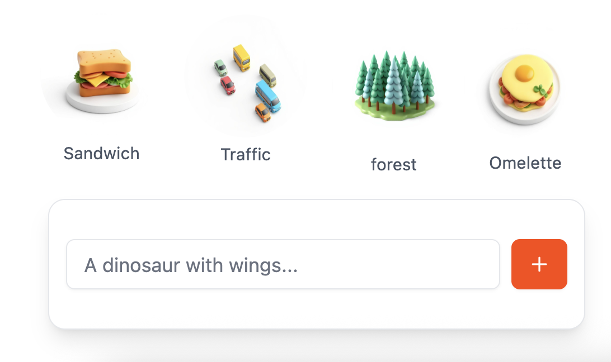

# Infinite Alchemy

<p align="center">
  
</p>

<p align="center">
  <a href="https://infinitealche.my">
    
  </a>
</p>

<div align="center">
  <a href="https://infinitealche.my">
    
  </a>
</div>

## About

Infinite Alchemy is an engaging puzzle game where you combine elements to discover new ones. Use your creativity and logic to unlock hundreds of unique combinations!

## Features

- 🧪 Combine elements to create new ones
- ✨ Beautiful and intuitive interface
- 🎮 Easy to play
- 💾 Progress automatically saved
- 🌟 Prompt new combinations

## Development

This project is built with:

- [Nuxt 3](https://nuxt.com) - The Vue Framework
- [TogetherAI](https://together.ai) - Llama 3.3 70B for text and Flux-schnell for image generation

### Setup

```bash
# Install dependencies
npm install

# Start development server
npm run dev

# Build for production
npm run build
```

## License

MIT License © 2024
